<div align="center">
  
  <a href="https://github.com/ujjwaltiwari01/ai-inbox-automation">
    
  </a>

  <br />

  

  <p style="font-size: 1.2em; color: #666;">
    <i>The "Executive Assistant" workflow that reads, sorts, and answers your emails 24/7.</i>
  </p>

  <div id="badges">
    <a href="https://n8n.io">
      
    </a>
    <a href="https://openai.com">
      
    </a>
    <a href="https://gmail.com">
      
    </a>
    <a href="https://python.langchain.com">
      
    </a>
  </div>

  <br />

  <p align="center">
    <a href="#-the-workflow-visualized"><strong>See the Flow</strong></a> •
    <a href="#-features"><strong>Key Features</strong></a> •
    <a href="#-prompt-engineering-lab"><strong>Prompt Lab</strong></a> •
    <a href="#-setup-guide"><strong>Deploy</strong></a>
  </p>

  
  
  
</div>

---

## 🤯 The "Why"
> **"Be honest — how many times have you opened your inbox and instantly felt overwhelmed?"**

It’s not the volume. It’s the **decision fatigue**.
Every unread email is a micro-decision waiting to be made.
* "Is this urgent?"
* "Is this spam?"
* "Do I need to pay this?"

<div align="center"> 
  <table>
    <thead>
      <tr>
        <th align="center">🛑 OLD WAY (Manual Pilot)</th>
        <th align="center">✅ NEW WAY (AI Pilot)</th>
      </tr>
    </thead>
    <tbody>
      <tr>
        <td>
          ❌ <b>Mental Load:</b> High. <br>
          ❌ <b>Response:</b> Hours/Days. <br>
          ❌ <b>Stress:</b> Constant.
        </td>
        <td>
          🧠 <b>Mental Load:</b> Zero. <br>
          ⚡ <b>Response:</b> Seconds. <br>
          🧘 <b>State:</b> Zen.
        </td>
      </tr>
    </tbody>
  </table>
</div>

---

<h2 id="-features">✨ Key Features</h2>

<table align="center">
  <tr>
    <td align="center" width="50%">
      <h3>🧠 Contextual Understanding</h3>
      <p>Doesn't just keyword match. It reads the <b>entire email body</b> to understand sentiment, intent, and urgency.</p>
    </td>
    <td align="center" width="50%">
      <h3>⚡ Instant Classification</h3>
      <p>Sorts emails into <b>Priority, Support, Finance, or Promo</b> within seconds of arrival.</p>
    </td>
  </tr>
  <tr>
    <td align="center" width="50%">
      <h3>✍️ Human-Like Drafting</h3>
      <p>Pre-writes replies in your tone. You just review and hit send. <b>Zero writing required.</b></p>
    </td>
    <td align="center" width="50%">
      <h3>🛡️ Spam Shield</h3>
      <p>Identifies sophisticated spam that bypasses Gmail's default filters.</p>
    </td>
  </tr>
</table>

---

## 🧩 The Workflow Visualized
This is not just a script. It's a **cognitive architecture** running on n8n.

```mermaid
graph TD
    %% Nodes
    Trigger[📩 Gmail Trigger]:::gmail
    Classifier{🧠 AI Classifier}:::ai
    
    %% Categories
    Priority[🔥 High Priority]:::urgent
    Support[🛠️ Support]:::support
    Finance[💰 Finance]:::finance
    Promo[📢 Promotion]:::promo
    
    %% Actions
    Draft[✍️ Draft Reply]:::action
    Reply[↩️ Auto-Reply]:::action
    Summary[📝 Summary]:::action
    Forward[📨 Forward Email]:::action

    %% Flow
    Trigger -->|New Unread Email| Classifier
    
    Classifier -->|Urgent Request| Priority
    Priority -->|Apply Label| Draft
    Draft -->|Executive Asst Persona| End1((Draft Ready)):::endnode

    Classifier -->|Customer Issue| Support
    Support -->|Apply Label| Reply
    Reply -->|Support Rep Persona| End2((Sent Reply)):::endnode

    Classifier -->|Invoice/Bill| Finance
    Finance -->|Apply Label| Summary
    Summary -->|Finance Asst Persona| Forward
    Forward -->|To: Finance Dept| End3((Forwarded)):::endnode

    Classifier -->|Marketing| Promo
    Promo -->|Apply Label| End4((Summarized)):::endnode

    %% Styling
    classDef gmail fill:#EA4335,color:white,stroke:none
    classDef ai fill:#10A37F,color:white,stroke:none
    classDef urgent fill:#FF4B4B,color:white,stroke:none
    classDef support fill:#4285F4,color:white,stroke:none
    classDef finance fill:#34A853,color:white,stroke:none
    classDef promo fill:#FBBC05,color:black,stroke:none
    classDef action fill:#333,color:white,stroke:#fff
    classDef endnode fill:#none,stroke:#666,stroke-width:2px,stroke-dasharray: 5 5
```



---

## 📂 Repository Structure
A clean look at what resides in this repo.

```bash
ai-inbox-automation/
├── README.md                 # 📖 You are reading this
├── JUx2ZfNfD64 - 1.json      # 🧠 The Master Workflow (Import this!)
└── assets/                   # 🖼️ Images & Icons
    └── banner.gif            #    (Header Animation)
```

---

## 🧠 Prompt Engineering Lab
This agent isn't just "calling GPT". It uses **Role-Based Prompting** to switch personas.

<div align="center">
  
<details>
<summary><b>🕵️ The Classifier (The Brain)</b></summary>
<br>
<blockquote>
"Please classify the text provided by the user into one of the following categories: {categories}, and use the provided formatting instructions below. Don't explain, and only output the json."
<br><br>
<b>Categories Defined:</b>
<ul>
<li><code>High Priority</code>: Urgent, key stakeholders, deadlines.</li>
<li><code>Customer Support</code>: Service requests, feedback.</li>
<li><code>Promotions</code>: Marketing, newsletters.</li>
<li><code>Finance/Billing</code>: Invoices, receipts.</li>
</ul>
</blockquote>
</details>

<details>
<summary><b>👔 The Executive Assistant (High Priority)</b></summary>
<br>
<blockquote>
"You are an executive assistant. Your job is to respond to incoming high priority inquiries as accurately as you can."
<br><i>(Generates a draft response for your review)</i>
</blockquote>
</details>

<details>
<summary><b>🎧 The Support Rep (Customer Service)</b></summary>
<br>
<blockquote>
"You are a customer service representative. Your job is to respond to incoming customer support inquiries as accurately as you can, and if it is an inquiry you cannot handle, please refer the user to the following email: customersupport@abccorp.com"
<br><i>(Sends an automatic reply immediately)</i>
</blockquote>
</details>

<details>
<summary><b>💼 The Accountant (Finance)</b></summary>
<br>
<blockquote>
"You are a finance/billing assistant. Your job is to summarize incoming emails relating to finance and billing and summarize them in a short and concise way."
<br><i>(Summarizes and forwards the email)</i>
</blockquote>
</details>

</div>

---

## 🚀 Setup Guide (5 Minutes)

### 1. Pre-Flight Check 📋
- [ ] **n8n Instance**: Running on Cloud or Self-Hosted.
- [ ] **OpenAI Key**: Needs `gpt-4o` access.
- [ ] **Gmail Account**: Accessible via OAuth2.

### 2. Import & Config 📥
1.  **Download** the `JSON` file from this repo.
2.  **Import** into n8n.
3.  **Credentials**: You will see nodes asking for credentials.
    - `Gmail account 2`: Create a new Gmail OAuth2 credential.
    - `OpenAi account 2`: Enter your OpenAI API Key.

### 3. Critical Customization ⚠️
The workflow has some **hardcoded values** you MUST change for it to work for **you**:

| Node Name | Setting to Change | Current Value (CHANGE THIS) |
| :--- | :--- | :--- |
| **Send to Finance Dept** | `To Email` | `uppitdigital@gmail.com` |
| **Gmail Trigger** | `Poll Time` | `Every Minute` (Adjust if needed) |
| **Creating Email** | `System Prompt` | `customersupport@abccorp.com` |

---

##  Node-by-Node Explanation

### 1. Gmail Trigger (`Gmail Trigger`)
*   **Role**: The Watchdog.
*   **Settings**: Polls every 1 minute.
*   **Why**: Ensures we only process new, unseen emails.

### 2. Text Classifier (`Text Classifier`)
*   **Role**: The Router.
*   **Logic**: Uses a specific schema to map email content to one of 4 keys.

### 3. OpenAI Chat Model
*   **Role**: The Brain.
*   **Model**: `gpt-4o`.
*   **Reasoning**: We need high intelligence to distinguish between a "Support Request" and a "Support Complaint" (Priority).

### 4. Action Nodes
*   **Creating Draft (GPT)**: Generates a human-like response.
*   **Draft (Gmail)**: Saves that response to your drafts folder.
*   **Auto Reply (Gmail)**: Automatically replies to the thread.

---

## ❓ Frequently Asked Questions

### Q: Does this cost money to run?
**A:** Yes.
1.  **n8n**: Free if self-hosted.
2.  **OpenAI**: You pay per 1k tokens.

### Q: Is it safe to give n8n access to my Gmail?
**A:** If you self-host n8n, **yes**. The data never leaves your server except to go to OpenAI for processing.

---

## 🛡️ Privacy & Security Policy
Your email data is sensitive. Here is how this workflow handles it:

1.  **Data Transmission**: Email bodies are sent to OpenAI API.
2.  **Storage**: n8n stores execution logs (inputs/outputs).
3.  **Access Control**: The `Gmail Credential` has read/write access.

---

<br />
<div align="center">
  
  <br />
  
  <p><b>Built for the "30 Days of AI Agents" Challenge</b></p>
  <p>
    <a href="https://github.com/ujjwaltiwari01" target="_blank">
      
    </a>
    <a href="https://twitter.com" target="_blank">
      
    </a>
  </p>
</div>
