<div align="center">
  
  
  
  
  

  <h1 style="border-bottom: none;">📧 AI Inbox Management Agent</h1>
  <p style="font-size: 1.2em; color: #666;">
    <i>The "Executive Assistant" workflow that reads, sorts, and answers your emails 24/7.</i>
  </p>

  <p align="center">
    <a href="#-the-workflow-visualized"><strong>See the Flow</strong></a> •
    <a href="#-prompt-engineering-lab"><strong>See the Prompts</strong></a> •
    <a href="#-setup-guide"><strong>Deploy Now</strong></a>
  </p>

  
  
  
</div>

---

## 🤯 The "Why"
> **"Be honest — how many times have you opened your inbox and instantly felt overwhelmed?"**

It’s not the volume. It’s the **decision fatigue**.
Every unread email is a micro-decision waiting to be made.
* "Is this urgent?"
* "Is this spam?"
* "Do I need to pay this?"

### 🛑 OLD WAY (Manual Pilot)
| ❌ Chaos | ❌ Slow | ❌ Stressful |
| :--- | :--- | :--- |
| **Mental Load**: High. You read every subject line. | **Response Time**: Hours or Days. | **Missed Opportunities**: "Did I reply to that client?" |
| **Organization**: "I'll tag it later." (You never do). | **Spam**: Clutters the view. | **Anxiety**: The number keeps going up. |

### ✅ NEW WAY (AI Pilot)
| 🧠 Clarity | ⚡ Instant | 🧘 Zen |
| :--- | :--- | :--- |
| **Mental Load**: Zero. AI reads for you. | **Response Time**: Seconds. | **Capture**: Important emails get drafted instantly. |
| **Organization**: Auto-labeled before you see it. | **Noise**: Filtered out. | **Peace**: Only open the inbox to *review*, not *sort*. |

---

## 🧩 The Workflow Visualized
This is not just a script. It's a **cognitive architecture** running on n8n.

```mermaid
graph TD
    %% Nodes
    Trigger[📩 Gmail Trigger]:::gmail
    Classifier{🧠 AI Classifier}:::ai
    
    %% Categories
    Priority[🔥 High Priority]:::urgent
    Support[🛠️ Support]:::support
    Finance[💰 Finance]:::finance
    Promo[📢 Promotion]:::promo
    
    %% Actions
    Draft[✍️ Draft Reply]:::action
    Reply[↩️ Auto-Reply]:::action
    Summary[📝 Summary]:::action
    Forward[� Forward Email]:::action

    %% Flow
    Trigger -->|New Unread Email| Classifier
    
    Classifier -->|Urgent Request| Priority
    Priority -->|Apply Label| Draft
    Draft -->|Executive Asst Persona| End1((Draft Ready)):::endnode

    Classifier -->|Customer Issue| Support
    Support -->|Apply Label| Reply
    Reply -->|Support Rep Persona| End2((Sent Reply)):::endnode

    Classifier -->|Invoice/Bill| Finance
    Finance -->|Apply Label| Summary
    Summary -->|Finance Asst Persona| Forward
    Forward -->|To: Finance Dept| End3((Forwarded)):::endnode

    Classifier -->|Marketing| Promo
    Promo -->|Apply Label| End4((Summarized)):::endnode

    %% Styling
    classDef gmail fill:#EA4335,color:white,stroke:none
    classDef ai fill:#10A37F,color:white,stroke:none
    classDef urgent fill:#FF4B4B,color:white,stroke:none
    classDef support fill:#4285F4,color:white,stroke:none
    classDef finance fill:#34A853,color:white,stroke:none
    classDef promo fill:#FBBC05,color:black,stroke:none
    classDef action fill:#333,color:white,stroke:#fff
    classDef endnode fill:#none,stroke:#666,stroke-width:2px,stroke-dasharray: 5 5
```



---

## � Repository Structure
A clean look at what you are downloading.
```bash
.
├── 📄 README.md                 # You are here
├── 📄 JUx2ZfNfD64 - 1.json      # The Master Workflow File (Import this!)
└── 📂 assets
    └── 🖼️ banner.png            # Visual assets
```

---

## 🧠 Prompt Engineering Lab
This agent isn't just "calling GPT". It uses **Role-Based Prompting** to switch personas.
Here are the *actual* system prompts used in the node logic.

<details>
<summary><b>🕵️ The Classifier (The Brain)</b></summary>
> "Please classify the text provided by the user into one of the following categories: {categories}, and use the provided formatting instructions below. Don't explain, and only output the json."
>
> **Categories Defined:**
> - `High Priority`: Urgent, key stakeholders, deadlines (ASAP, immediate).
> - `Customer Support`: Service requests, feedback, tickets.
> - `Promotions`: Marketing, newsletters, offers.
> - `Finance/Billing`: Invoices, receipts, payments.
</details>

<details>
<summary><b>👔 The Executive Assistant (High Priority)</b></summary>
> "You are an executive assistant. Your job is to respond to incoming high priority inquiries as accurately as you can."
> *(Generates a draft response for your review)*
</details>

<details>
<summary><b>🎧 The Support Rep (Customer Service)</b></summary>
> "You are a customer service representative. Your job is to respond to incoming customer support inquiries as accurately as you can, and if it is an inquiry you cannot handle, please refer the user to the following email: customersupport@abccorp.com"
> *(Sends an automatic reply immediately)*
</details>

<details>
<summary><b>💼 The Accountant (Finance)</b></summary>
> "You are a finance/billing assistant. Your job is to summarize incoming emails relating to finance and billing and summarize them in a short and concise way."
> *(Summarizes and forwards the email)*
</details>

<details>
<summary><b>📰 The Marketer (Promotions)</b></summary>
> "You are in charge of promotions. Please evaluate the incoming promotional email and give us a quick summary and a recommendation."
</details>

---

## 🚀 Setup Guide (5 Minutes)

### 1. Pre-Flight Check 📋
- [ ] **n8n Instance**: Running on Cloud or Self-Hosted.
- [ ] **OpenAI Key**: Needs `gpt-4o` access.
- [ ] **Gmail Account**: Accessible via OAuth2.

### 2. Import & Config 📥
1.  **Download** the `JSON` file from this repo.
2.  **Import** into n8n.
3.  **Credentials**: You will see nodes asking for credentials.
    - `Gmail account 2`: Create a new Gmail OAuth2 credential.
    - `OpenAi account 2`: Enter your OpenAI API Key.

### 3. Critical Customization ⚠️
The workflow has some **hardcoded values** you MUST change for it to work for **you**:

| Node Name | Setting to Change | Current Value (CHANGE THIS) |
| :--- | :--- | :--- |
| **Send to Finance Dept** | `To Email` | `uppitdigital@gmail.com` |
| **Gmail Trigger** | `Poll Time` | `Every Minute` (Adjust if needed) |
| **Creating Email** | `System Prompt` | `customersupport@abccorp.com` |

### 4. Create Labels 🏷️
The workflow tries to apply these labels. Create them in Gmail to avoid errors:
*   `High Priority`
*   `Customer Support`
*   `Promotion`
*   `Finance/Billing`

---

## 🛠️ Tech Stack
| Component | Technology | Reasoning |
| :--- | :--- | :--- |
| **Orchestrator** |  | Visual, self-hosted, powerful logic handling. |
| **LLM** |  | Best-in-class reasoning for complex classification. |
| **Mail** |  | Universal email provider with robust API. |
| **Logic** |  | Chaining LLM outputs to structure JSON data. |


---

## 📚 Node-by-Node Explanation
Understand every gear in the machine.

### 1. Gmail Trigger (`Gmail Trigger`)
*   **Role**: The Watchdog.
*   **Settings**: Polls every 1 minute.
*   **Filters**: Only checks for emails with the label `UNREAD` in the `INBOX`.
*   **Why**: Ensures we only process new, unseen emails.

### 2. Text Classifier (`Text Classifier`)
*   **Role**: The Router.
*   **Type**: LangChain Text Classifier.
*   **Logic**: Uses a specific schema to map email content to one of 4 keys.
*   **Output**: A clean JSON string with the category.

### 3. OpenAI Chat Model (`OpenAI Chat Model`)
*   **Role**: The Brain.
*   **Model**: `gpt-4o`.
*   **Reasoning**: We need high intelligence to distinguish between a "Support Request" and a "Support Complaint" (Priority).
*   **Cost**: Uses minimal tokens as it only outputs classification keys.

### 4. The "Switch" Logic
The workflow branches based on the classifier's output.
*   **Branch 1 (Priority)**: Connects to `High Priority` node.
*   **Branch 2 (Support)**: Connects to `Customer Support` node.
*   **Branch 3 (Promo)**: Connects to `Promotion` node.
*   **Branch 4 (Finance)**: Connects to `Finance/Billing` node.

### 5. Action Nodes
*   **Creating Draft (GPT)**: Generates a human-like response.
*   **Draft (Gmail)**: Saves that response to your drafts folder. it does *not* send it (for safety).
*   **Auto Reply (Gmail)**: Automatically replies to the thread. Useful for standard support acknowledgments.
*   **Send to Finance Dept (Gmail)**: Forwards the email body to your accountant/CFO.

---

## ❓ Frequently Asked Questions

### Q: Does this cost money to run?
**A:** Yes.
1.  **n8n**: Free if self-hosted, paid if using n8n Cloud.
2.  **OpenAI**: You pay per 1k tokens. For normal personal inbox volume, this is usually **<$2 per month**.

### Q: Why didn't it trigger on my test email?
**A:** n8n polls every 60 seconds. Wait at least a minute. Also, ensure the email is **Unread** and in the **Primary Inbox** (not moving to Spam/Promotions by Google's own filters first).

### Q: Can I use a local LLM like Llama3?
**A:** Absoutely. Swap the `OpenAI Chat Model` node for an `Ollama` node.
*   *Caveat*: Local models might be less accurate at nuance classification unless fine-tuned.

### Q: Is it safe to give n8n access to my Gmail?
**A:** If you self-host n8n, **yes**. The data never leaves your server except to go to OpenAI for processing. If you use n8n Cloud, they are SOC2 compliant.

### Q: How do I change the prompts?
**A:** Open the `Creating Draft` or `Creating Email` nodes. You will see a "System Message". Edit that text to change the AI's persona (e.g., "You are a pirate" 🏴‍☠️).

---

## 🛡️ Privacy & Security Policy
Your email data is sensitive. Here is how this workflow handles it:

1.  **Data Transmission**: Email bodies are sent to OpenAI API.
    *   *Mitigation*: OpenAI does not use API data for training by default (check your settings).
2.  **Storage**: n8n stores execution logs (inputs/outputs).
    *   *Mitigation*: You can disable execution logging in n8n settings for higher privacy.
3.  **Access Control**: The `Gmail Credential` has read/write access.
    *   *Warning*: Never share your n8n credentials.

---

## 🔮 Future Roadmap
*   [ ] **Slack Integration**: Send "High Priority" alerts to a Slack channel.
*   [ ] **Attachment Parsing**: Use OCR to read PDF invoices in the Finance branch.
*   [ ] **Calendar Sync**: Detect meeting requests and auto-check availability.

---

## 🤝 Contributing
Got a better prompt? A smarter routing logic?
1. Fork it.
2. Branch it (`git checkout -b feature/SmartRouting`).
3. Commit it (`git commit -m 'Added regex filtering'`).
4. Push it.
5. **Pull Request**.

---

<div align="center">
  <p><b>Built for the "30 Days of AI Agents" Challenge</b></p>
  <p>
    <a href="https://github.com/ujjwaltiwari01" target="_blank">
      
    </a>
    <a href="https://twitter.com" target="_blank">
      
    </a>
  </p>
</div>
